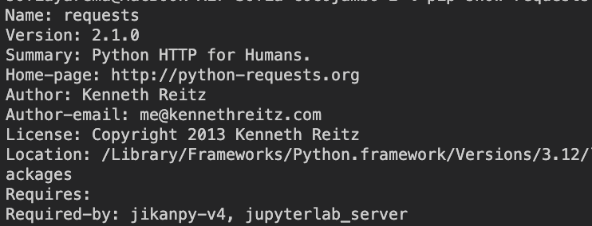

# Звіт до роботи

## Тема: _Робота у віртуальних середовищах_

### Мета роботи: _Робота у віртуальних середовищах_

---

### Виконання роботи

**Результати**

## Основи роботи з сторонніми бібліотеками

- 2.  Перевірка, які бібліотеки вже інстальовані на компютері:
      
- 4.  результат виконання команд
      
- 5.  методи є в бібліотеці requests:
      
- 7.  результат виконання команд:
      
      
- 9. Запуск програми:
     
     

