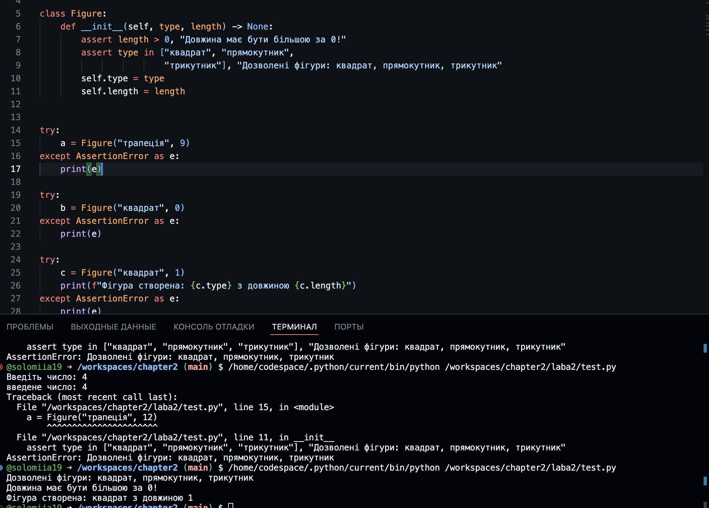
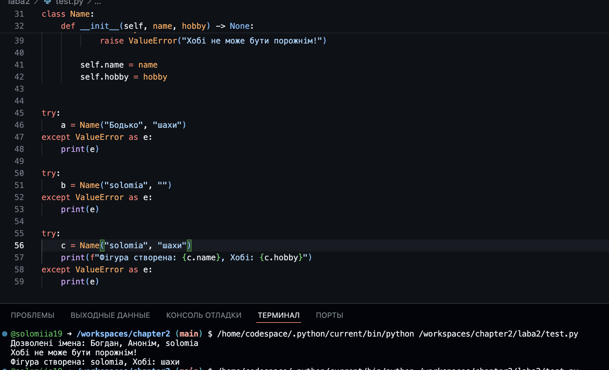

# Звіт до роботи

## Тема: _Написання тестів на Python_

### Мета роботи: _Написання тестів на Python_

---

### Виконання роботи

**Результати**

- 2. Створюю власний крок assert та роблю тестові превірки при введенні даних з клавіатури:
     
- 4.  assert для перевірки (валідації) правильності вводу аргументів:
      
- 6.  Додаю власне імя в перевірку та створюю обєкт:
      

