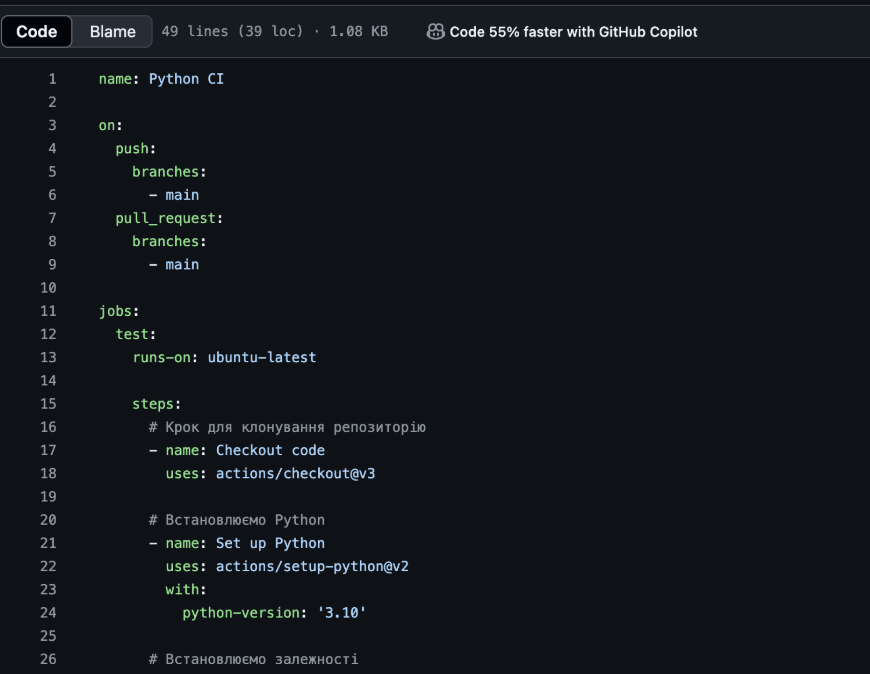

# Звіт до роботи

## Тема: _Автоматизація процесу тестування_

### Мета роботи: _Автоматизація процесу тестування_

---

### Виконання роботи

**Результати**

## Створення декількох Workflow або завдань
- 1. 
      

- 2. Інтеграція з Coverage (Додатково)

- 3. Баджі та статуси 

- 4. 

