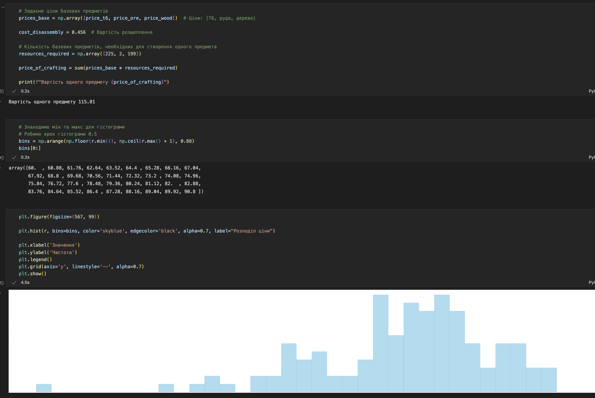
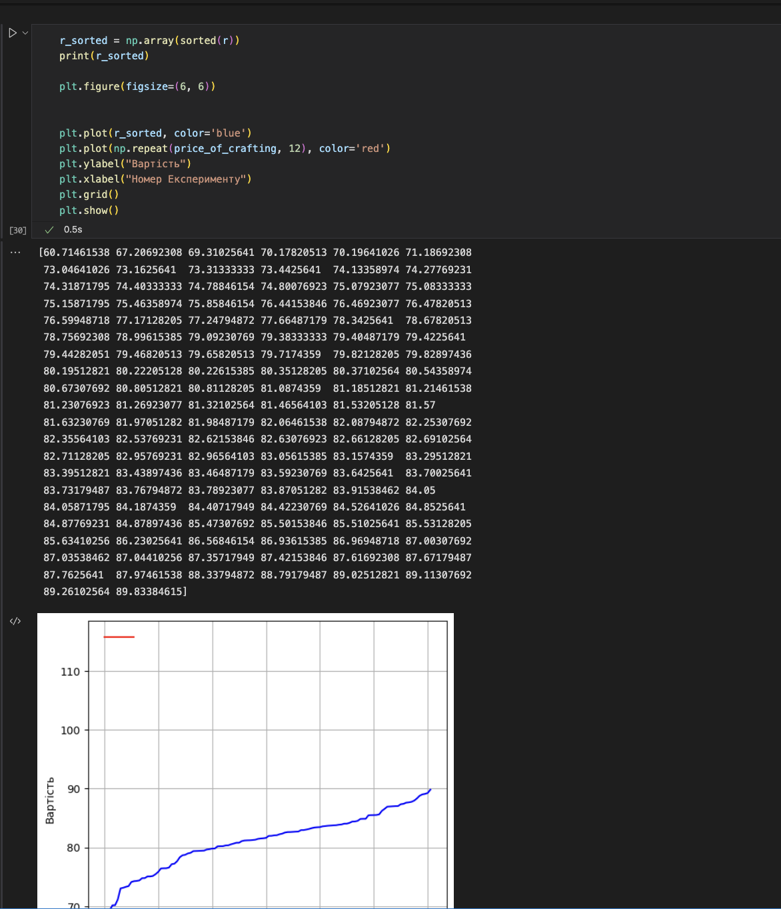
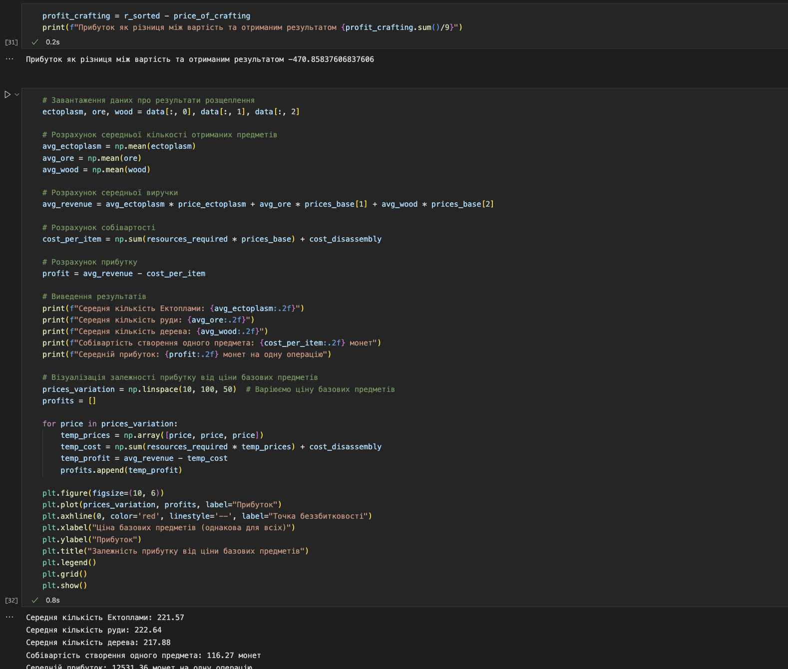

# Звіт до роботи

## Тема: _Розвʼязання задач лінійного рограмування_

### Мета роботи: _Розвʼязання задач лінійного рограмування_

---

### Виконання роботи

**Результати**

## Ecto statistics

- 1.  

- 2.  

- 3.  

- 4.  

- 5.  

- 6.  